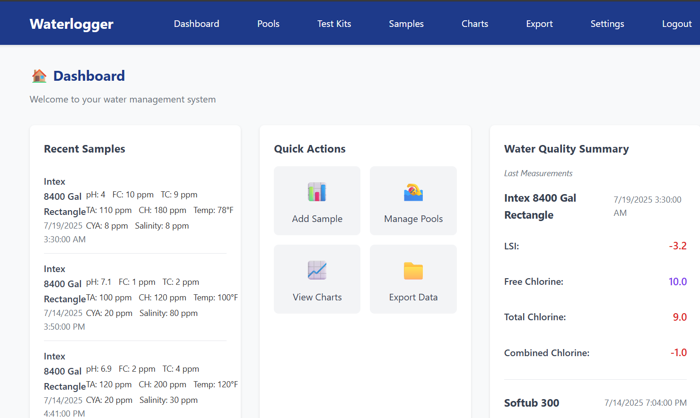
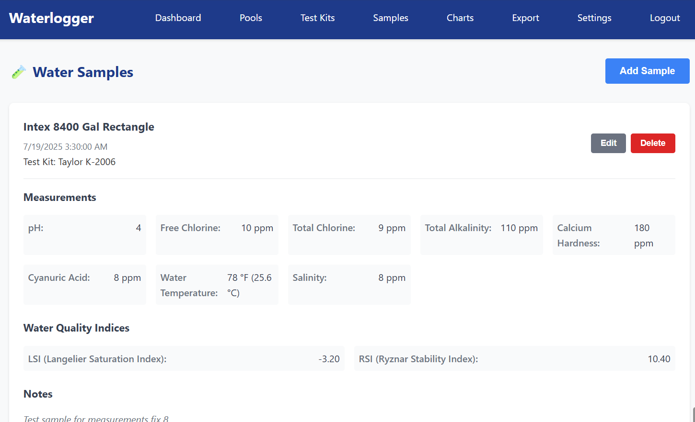

# Waterlogger

A comprehensive web application for managing pool and hot tub water chemistry parameters, with built-in calculations, data visualization, and export capabilities. Built entirely, including the documentation (but not screenshots), by talking to the computer, in this case, Claude Code using the Sonnet 4 model.

## Features

- **Multi-User Support**: Multiple users can manage water testing data with full CRUD operations
- **User Management**: Complete user administration with create, edit, and delete capabilities
- **Pool Management**: Track multiple pools and hot tubs with detailed specifications
- **Test Kit Management**: Organize and track testing equipment and supplies
- **Water Chemistry**: Record comprehensive water parameter measurements
- **Automatic Calculations**: LSI (Langelier Saturation Index) and RSI (Ryznar Stability Index) calculations
- **Data Visualization**: Interactive charts showing parameter trends over time
- **Export Functionality**: Export data to Excel and Markdown formats
- **Responsive Design**: Mobile-friendly interface with modern UI
- **Database Flexibility**: Support for SQLite and MariaDB databases
- **Cross-Platform**: Single executable for Windows and Linux
- **Build Timestamps**: Each build includes deployment tracking in the UI

## Screenshots


*Main dashboard showing recent samples and pool status*


*First-run setup wizard for configuration*

## Quick Start

### Prerequisites

- Go 1.21 or later (for building from source)
- SQLite (included) or MariaDB (optional)

### Installation

#### Option 1: Download Pre-built Binary

1. Download the latest release for your platform from [Releases](https://github.com/your-org/waterlogger/releases)
2. Extract the binary to your desired location
3. Run the application

#### Option 2: Build from Source

```bash
# Clone the repository
git clone https://github.com/your-org/waterlogger.git
cd waterlogger

# Build with build timestamps (recommended)
./build.sh

# Or build manually
go build -o waterlogger cmd/waterlogger/main.go

# Run the application
./waterlogger
```

### First Run

1. Start the application
2. Open your web browser to `http://localhost:2342`
3. Complete the setup wizard to:
   - Create an administrator account
   - Configure database settings
   - Set server preferences

## Building and Running

### Windows

#### Prerequisites
- Go 1.21 or later
- Git (optional, for cloning)

#### Build Steps
```cmd
# Clone the repository (if not already done)
git clone https://github.com/your-org/waterlogger.git
cd waterlogger

# Download dependencies
go mod tidy

# Build with timestamps (Windows PowerShell)
$BUILD_TIME = Get-Date -Format "HH:mm:ss"
$BUILD_DATE = Get-Date -Format "yyyy-MM-dd"
go build -ldflags "-X main.BuildTime=$BUILD_TIME -X main.BuildDate=$BUILD_DATE" -o waterlogger.exe cmd/waterlogger/main.go

# Or build manually (without timestamps)
go build -o waterlogger.exe cmd/waterlogger/main.go

# Run the application
waterlogger.exe
```

#### Running as Windows Service
1. Copy the executable to your preferred location (e.g., `C:\Program Files\Waterlogger\`)
2. Create a Windows service using `sc create` or a service manager
3. Configure the service to run at startup

Example service creation:
```cmd
sc create Waterlogger binpath="C:\Program Files\Waterlogger\waterlogger.exe" start=auto
sc description Waterlogger "Pool and Hot Tub Water Management System"
sc start Waterlogger
```

### Linux

#### Prerequisites
- Go 1.21 or later
- Git (optional, for cloning)

#### Build Steps
```bash
# Clone the repository (if not already done)
git clone https://github.com/your-org/waterlogger.git
cd waterlogger

# Download dependencies
go mod tidy

# Build with timestamps (recommended)
./build.sh

# Or build manually
go build -o waterlogger cmd/waterlogger/main.go

# Make executable
chmod +x waterlogger

# Run the application
./waterlogger
```

#### Running as Linux Service (systemd)
1. Copy the executable to `/usr/local/bin/waterlogger`
2. Create a systemd service file:

```bash
sudo tee /etc/systemd/system/waterlogger.service > /dev/null <<EOF
[Unit]
Description=Waterlogger - Pool and Hot Tub Water Management System
After=network.target

[Service]
Type=simple
User=waterlogger
WorkingDirectory=/var/lib/waterlogger
ExecStart=/usr/local/bin/waterlogger
Restart=always
RestartSec=10

[Install]
WantedBy=multi-user.target
EOF
```

3. Enable and start the service:
```bash
# Create user and directory
sudo useradd -r -s /bin/false waterlogger
sudo mkdir -p /var/lib/waterlogger
sudo chown waterlogger:waterlogger /var/lib/waterlogger

# Enable and start service
sudo systemctl daemon-reload
sudo systemctl enable waterlogger
sudo systemctl start waterlogger

# Check status
sudo systemctl status waterlogger
```

### Cross-Platform Building

Build for multiple platforms with timestamps:

```bash
# Set build timestamp variables
BUILD_TIME=$(date '+%H:%M:%S')
BUILD_DATE=$(date '+%Y-%m-%d')

# Build for Windows (from any platform)
GOOS=windows GOARCH=amd64 go build -ldflags "-X main.BuildTime=$BUILD_TIME -X main.BuildDate=$BUILD_DATE" -o waterlogger.exe cmd/waterlogger/main.go

# Build for Linux (from any platform)
GOOS=linux GOARCH=amd64 go build -ldflags "-X main.BuildTime=$BUILD_TIME -X main.BuildDate=$BUILD_DATE" -o waterlogger cmd/waterlogger/main.go

# Build for macOS (from any platform)
GOOS=darwin GOARCH=amd64 go build -ldflags "-X main.BuildTime=$BUILD_TIME -X main.BuildDate=$BUILD_DATE" -o waterlogger-mac cmd/waterlogger/main.go
```

### Build Timestamps

The application includes build timestamp functionality that displays when the binary was compiled:

- **Location**: Small label in the bottom-right corner of every page
- **Format**: "Built on YYYY-MM-DD at HH:MM:SS"
- **Behavior**: Semi-transparent by default, fully visible on hover
- **Purpose**: Helps track deployments and identify running versions

#### Building with Timestamps

**Linux/macOS:**
```bash
# Use the provided build script
./build.sh

# Or manually
BUILD_TIME=$(date '+%H:%M:%S') BUILD_DATE=$(date '+%Y-%m-%d') \
go build -ldflags "-X main.BuildTime=$BUILD_TIME -X main.BuildDate=$BUILD_DATE" -o waterlogger cmd/waterlogger/main.go
```

**Windows PowerShell:**
```powershell
$BUILD_TIME = Get-Date -Format "HH:mm:ss"
$BUILD_DATE = Get-Date -Format "yyyy-MM-dd"
go build -ldflags "-X main.BuildTime=$BUILD_TIME -X main.BuildDate=$BUILD_DATE" -o waterlogger.exe cmd/waterlogger/main.go
```

## Configuration

### Configuration File

The application uses a YAML configuration file (`config.yaml`) with the following structure:

```yaml
server:
  port: 2342
  host: "localhost"

database:
  type: "sqlite" # sqlite or mariadb
  sqlite:
    path: "waterlogger.db"
  mariadb:
    host: "localhost"
    port: 3306
    username: "waterlogger"
    password: "password"
    database: "waterlogger"

app:
  name: "Waterlogger"
  version: "1.0.0"
  secret_key: "your-secret-key-change-this"
```

### Command Line Options

```bash
waterlogger [options]

Options:
  -config string           Path to configuration file (default: config.yaml)
  -version                 Show version information
  -help                    Show help message
  -migrate-to-mariadb      Migrate data from SQLite to MariaDB
  -migrate-to-sqlite       Migrate data from MariaDB to SQLite
  -export string           Export database data to backup file
  -import string           Import database data from backup file
  -reset-password string   Reset password for specified username
```

### Password Management

#### Resetting User Passwords

If you need to reset a user's password (e.g., if they forgot it), you can use the command-line password reset utility:

```bash
# Reset password for a specific user
./waterlogger -reset-password username

# Example: Reset password for user "jcz"
./waterlogger -reset-password jcz
```

The utility will prompt you to:
1. Enter a new password
2. Confirm the new password

**Note**: Passwords can be simple (no complexity requirements) - they only need to be non-empty.

#### Interactive vs Non-Interactive Mode

- **Interactive Mode**: When run in a terminal, the utility will securely prompt for password input (hidden typing)
- **Non-Interactive Mode**: When input is piped or redirected, it will read the password directly from stdin

Example of non-interactive usage:
```bash
echo "newpassword" | ./waterlogger -reset-password username
```

### Database Setup

#### SQLite (Default)
- No additional setup required
- Database file is created automatically
- Recommended for single-user or small deployments

#### MariaDB
1. Install MariaDB server
2. Create database and user:
```sql
CREATE DATABASE waterlogger;
CREATE USER 'waterlogger'@'localhost' IDENTIFIED BY 'your-password';
GRANT ALL PRIVILEGES ON waterlogger.* TO 'waterlogger'@'localhost';
FLUSH PRIVILEGES;
```
3. Update configuration file with connection details
4. Restart the application

## Usage

### Water Parameters

The application tracks the following water chemistry parameters:

- **FC (Free Chlorine)**: 1.0-4.0 ppm - Available chlorine for sanitization
- **TC (Total Chlorine)**: Should match FC - Total chlorine including combined chlorine
- **pH**: 7.4-7.6 - Acidity/alkalinity level
- **TA (Total Alkalinity)**: 80-120 ppm - pH buffering capacity
- **CH (Calcium Hardness)**: 200-400 ppm - Dissolved calcium concentration
- **CYA (Cyanuric Acid)**: 30-50 ppm - Chlorine stabilizer (optional)
- **Temperature**: Water temperature in °F
- **Salinity**: 2,700-3,400 ppm - For saltwater pools (optional)
- **TDS (Total Dissolved Solids)**: Total dissolved substances (optional)

### Calculated Indices

- **LSI (Langelier Saturation Index)**: Indicates water balance (-0.3 to +0.3 ideal)
- **RSI (Ryznar Stability Index)**: Predicts scaling tendency (6.0-7.0 ideal)

### Data Export

Export your data in two formats:

1. **Excel Export**: Multi-worksheet file with separate sheets for each data type
2. **Markdown Export**: Structured text report with tables and summaries

Files are named with format: `WL[timestamp].xlsx` or `WL[timestamp].md`

## API Documentation

### REST Endpoints

#### Authentication
- `POST /api/login` - User login
- `POST /api/logout` - User logout

#### Users
- `GET /api/users` - List all users
- `POST /api/users` - Create new user
- `PUT /api/users/:id` - Update user
- `DELETE /api/users/:id` - Delete user

#### Pools
- `GET /api/pools` - List all pools
- `POST /api/pools` - Create new pool
- `PUT /api/pools/:id` - Update pool
- `DELETE /api/pools/:id` - Delete pool

#### Test Kits
- `GET /api/kits` - List all test kits
- `POST /api/kits` - Create new test kit
- `PUT /api/kits/:id` - Update test kit
- `DELETE /api/kits/:id` - Delete test kit

#### Samples
- `GET /api/samples` - List all samples
- `POST /api/samples` - Create new sample
- `PUT /api/samples/:id` - Update sample
- `DELETE /api/samples/:id` - Delete sample

#### Charts
- `GET /api/charts/data` - Get chart data for visualization

#### Export
- `GET /api/export/excel` - Export data to Excel
- `GET /api/export/markdown` - Export data to Markdown

#### Settings
- `GET /api/settings` - Get user settings
- `POST /api/settings` - Update user settings

## Development

### Project Structure

```
waterlogger/
├── cmd/waterlogger/          # Application entry point
├── internal/
│   ├── config/              # Configuration management
│   ├── database/            # Database abstraction layer
│   ├── handlers/            # HTTP handlers
│   ├── middleware/          # HTTP middleware
│   ├── models/              # Data models
│   └── chemistry/           # Water chemistry calculations
├── web/
│   ├── static/              # Static assets (CSS, JS)
│   │   ├── css/             # Stylesheets
│   │   └── js/              # JavaScript files
│   └── templates/           # HTML templates
├── build.sh                 # Build script with timestamps
├── config.yaml              # Configuration file
├── CLAUDE.md               # Development notes
└── README.md               # This file
```

### Testing

```bash
# Run unit tests
go test ./...

# Run tests with coverage
go test -cover ./...

# Run integration tests
go test -tags integration ./...
```

### Contributing

1. Fork the repository
2. Create a feature branch (`git checkout -b feature/amazing-feature`)
3. Commit your changes (`git commit -m 'Add amazing feature'`)
4. Push to the branch (`git push origin feature/amazing-feature`)
5. Open a Pull Request

### Code Style

- Follow Go best practices and conventions
- Use `gofmt` for code formatting
- Include unit tests for new features
- Update documentation for API changes

## Troubleshooting

### Common Issues

#### Port Already in Use
If port 2342 is already in use, modify the configuration file:
```yaml
server:
  port: 3000  # Change to available port
```

#### Database Connection Issues
1. **SQLite**: Check file permissions and available disk space
2. **MariaDB**: Verify connection details and database server status

#### Template Loading Issues
Ensure the `web/templates` directory is present and accessible from the working directory.

### Log Files

Application logs are written to stdout by default. For service deployments, logs are typically captured by the service manager (systemd on Linux, Event Log on Windows).

### Performance Tuning

- **SQLite**: Use WAL mode for better concurrent access
- **MariaDB**: Configure connection pooling and query optimization
- **Memory**: Monitor memory usage for large datasets

## License

This project is licensed under the MIT License - see the [LICENSE](LICENSE) file for details.

## Support

- **Issues**: Report bugs and feature requests on [GitHub Issues](https://github.com/your-org/waterlogger/issues)
- **Discussions**: Join the community on [GitHub Discussions](https://github.com/your-org/waterlogger/discussions)
- **Documentation**: Visit the [Wiki](https://github.com/your-org/waterlogger/wiki) for detailed guides

## Acknowledgments

- Water chemistry calculations based on research from [WaterPy](https://github.com/johnzastrow/WaterPy)
- UI framework: [Alpine.js](https://alpinejs.dev/)
- Database ORM: [GORM](https://gorm.io/)
- Web framework: [Gin](https://gin-gonic.com/)

## Changelog

### Version 1.0.0
- Initial release
- Core water chemistry tracking
- Multi-user support with authentication
- User management system (CRUD operations)
- Pool and test kit management
- Export functionality (Excel and Markdown)
- Interactive data visualization
- Setup wizard for initial configuration
- Cross-platform support (Windows and Linux)
- Build timestamp tracking
- Database migration tools
- Password reset utility
- Responsive web design

---

**Waterlogger** - Making pool and hot tub water management simple and efficient.
