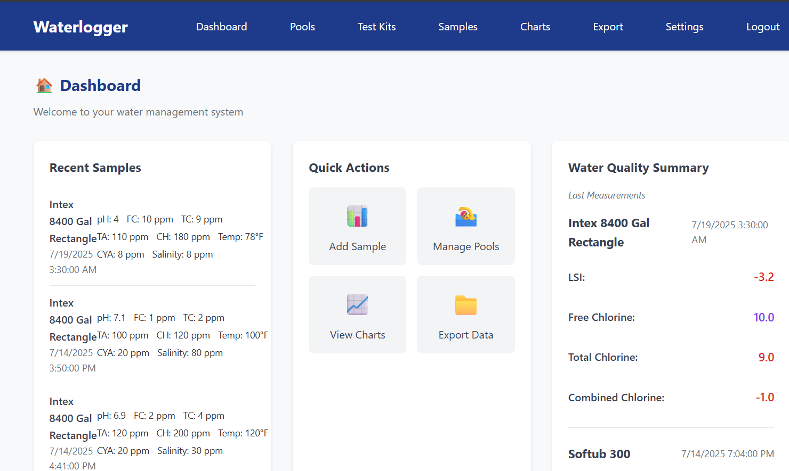
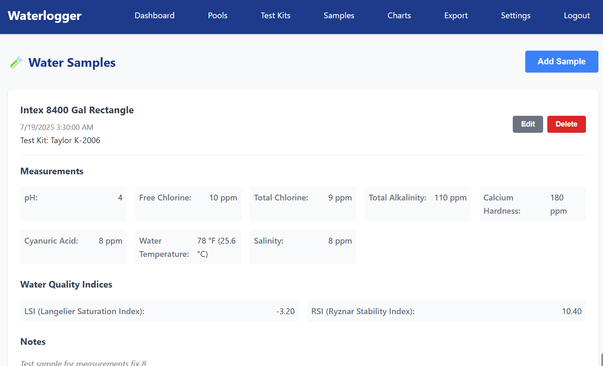

# Waterlogger

A comprehensive web application for managing pool and hot tub water chemistry parameters, with built-in calculations, data visualization, and export capabilities. Built entirely, including the documentation (but not screenshots), by talking to the computer, in this case, Claude Code using the Sonnet 4 model.

## Features

### Core Functionality
- **Multi-User Support**: Multiple users can manage water testing data with full authentication
- **User Management**: Complete user administration with create, edit, and delete capabilities
- **Pool Management**: Track multiple pools and hot tubs with detailed specifications
- **Test Kit Management**: Organize and track testing equipment and supplies
- **Water Chemistry**: Record comprehensive water parameter measurements
- **Automatic Calculations**: LSI (Langelier Saturation Index) and RSI (Ryznar Stability Index) calculations
- **Data Visualization**: Interactive charts showing parameter trends over time

### Advanced Features (Version 1.2+)
- **Pool Volume Calculator**: Comprehensive volume calculation system supporting rectangular, round, oval, kidney, and L-shaped pools with varying depths, steps, and attached spas
- **Chemical Adjustment System**: Professional-grade water balance calculations with precise chemical dosing recommendations for 11 different pool chemicals
- **Water Balance Analysis**: Real-time LSI/RSI calculations with color-coded indicators for optimal water balance
- **Adjustment History**: Complete tracking of chemical adjustments with before/after conditions and user notes
- **PDF Export**: Professional PDF generation for adjustment details with safety guidelines and water balance explanations
- **Dashboard Analytics**: Quick overview of recent samples, water quality status, and recent adjustments across all pools

### Database Management (Version 1.4+)
- **Schema Migration System**: Version-tracked database schema changes with automatic migration on startup
- **Migration Management UI**: View complete migration history and status from the settings page
- **One-Click Database Backups**: Create timestamped JSON backups directly from the web interface
- **Web-Based Backup Import** (Version 1.5+): Upload and restore JSON backups through the Settings page with backwards compatibility
- **Migration Commands**: Command-line tools for viewing status and rolling back migrations
- **Cross-Database Migration**: Bidirectional data migration between SQLite and MariaDB
- **Enhanced Settings UI**: Comprehensive system information display including app version, build info, database type, and schema version

### Deployment Automation (Version 1.4+)
- **Automated Linux Deployment**: One-command deployment script (`deploy-linux.sh`) that handles everything from directory creation to systemd service installation
- **Automated Windows Deployment**: One-command deployment script (`deploy-windows.bat`) for Windows service installation
- **Security Hardening**: Systemd service includes NoNewPrivileges, ProtectSystem, and other security features
- **Production-Ready Defaults**: Optional automatic configuration for production logging settings
- **Service Management**: Automatic service creation with restart policies and proper permissions

### Technical Features
- **Export Functionality**: Export data to Excel, Markdown, and JSON backup formats
- **Responsive Design**: Mobile-friendly interface with modern UI and professional favicon
- **Database Flexibility**: Support for SQLite and MariaDB databases with migration capabilities
- **Cross-Platform**: Single executable for Windows and Linux
- **Build Timestamps**: Each build includes deployment tracking in the UI
- **Structured Logging**: High-performance logging with rotation, multiple outputs, and audit trails

## Screenshots


*Main dashboard showing recent samples and pool status*


*First-run setup wizard for configuration*

## Quick Start

### Prerequisites

- Go 1.21 or later (for building from source)
- SQLite (included) or MariaDB (optional)

### Installation

#### Option 1: Download Pre-built Binary

1. Download the latest release for your platform from [Releases](https://github.com/johnzastrow/waterlogger/releases)
2. Extract the binary to your desired location
3. Run the application

#### Option 2: Build from Source

**⚠️ Prerequisites:** SQLite requires CGO (C compiler). See detailed build requirements below.

```bash
# Clone the repository
git clone https://github.com/johnzastrow/waterlogger.git
cd waterlogger

# Install build tools first (see platform-specific instructions below)

# Build using the build script (recommended)
./build.sh      # Linux/macOS
build.bat       # Windows

# Run the application
./waterlogger         # Linux/macOS
waterlogger.exe       # Windows
```

See **[docs/BUILD_AND_RUN.md](docs/BUILD_AND_RUN.md)** for platform-specific setup instructions.

### First Run

1. Start the application
2. Open your web browser to `http://localhost:2342`
3. Complete the setup wizard to:
   - Create an administrator account
   - Configure database settings
   - Set server preferences

## Building and Running

For comprehensive build, run, and debugging instructions, see **[docs/BUILD_AND_RUN.md](docs/BUILD_AND_RUN.md)** (recommended).

This document covers:
- **Building from source** (all platforms)
- **Running locally** (development mode)
- **Running in production** (service deployment)
- **Debugging and troubleshooting**
- **Command-line options**

### Quick Start (TL;DR)

**Prerequisites:**
- Go 1.21 or later
- C compiler: MSYS2 MinGW-w64 (Windows) or build-essential (Linux) or Xcode tools (macOS)

**Build:**
```bash
./build.sh     # Linux/macOS
build.bat      # Windows
```

**Run:**
```bash
./waterlogger  # Linux/macOS
waterlogger.exe  # Windows
```

**Access:** Open browser to `http://localhost:2342`

### Quick Deployment

**Linux (Automated):**
```bash
sudo ./deploy-linux.sh
```

**Windows (Automated, as Administrator):**
```cmd
deploy-windows.bat
```

For detailed instructions, platform-specific setup, troubleshooting, and all other information, see:
- **[docs/BUILD_AND_RUN.md](docs/BUILD_AND_RUN.md)** - Complete guide (recommended)
- **[docs/BUILD_REQUIREMENTS.md](docs/BUILD_REQUIREMENTS.md)** - Platform-specific build requirements
- **[docs/DEPLOYMENT.md](docs/DEPLOYMENT.md)** - Deployment options and configuration

## Configuration

### Configuration File

The application uses a YAML configuration file (`config.yaml`). A fully commented example configuration is provided in `config.example.yaml`.

**First-time setup:**
```bash
cp config.example.yaml config.yaml
# Edit config.yaml with your settings
```

The `config.example.yaml` file includes detailed comments explaining:
- Server settings (port, host)
- **Database configuration** (SQLite vs MariaDB with complete setup instructions)
- Application settings (secret key generation)
- Logging options (levels, formats, rotation)

**Basic configuration structure:**
```yaml
server:
  port: 2342              # Web server port
  host: "localhost"       # Bind address

database:
  type: "sqlite"          # "sqlite" or "mariadb"
  sqlite:
    path: "waterlogger.db"
  mariadb:                # See config.example.yaml for setup instructions
    host: "localhost"
    port: 3306
    username: "waterlogger"
    password: "password"
    database: "waterlogger"

app:
  name: "Waterlogger"
  version: "1.4.0"
  secret_key: "change-this-to-a-secure-random-string"

logging:
  level: "info"           # debug, info, warn, error, fatal
  format: "console"       # json, console
  output: "both"          # stdout, file, both
  # ... see config.example.yaml for full logging options
```

**For detailed MariaDB setup and migration instructions, see the comments in `config.example.yaml`.**

### Server Configuration

#### Changing the Port

To change the port the application listens on, modify the `server.port` value in your `config.yaml` file:

```yaml
server:
  port: 8080  # Change from default 2342 to 8080
  host: "localhost"
```

After making this change, restart the application. The web interface will be available at `http://localhost:8080` (or whatever port you specified).

#### Changing the Host

To configure which hosts the application will accept connections from, modify the `server.host` value:

**For localhost only (default - most secure):**
```yaml
server:
  host: "localhost"  # Only accepts connections from localhost/127.0.0.1
```

**For all network interfaces (allows remote connections):**
```yaml
server:
  host: "0.0.0.0"  # Accepts connections from any IP address
```

**For specific network interface:**
```yaml
server:
  host: "192.168.1.100"  # Only accepts connections to this specific IP
```

⚠️ **Security Warning**: Setting `host: "0.0.0.0"` allows connections from any IP address that can reach your server. Only use this setting if you understand the security implications and have proper firewall rules in place.

#### Complete Example

```yaml
server:
  port: 8080
  host: "0.0.0.0"  # Accept connections from any IP on port 8080
```

### Production Mode and Logging

#### Running in Production Mode

For production deployments, you should configure the application to run in production mode, which provides better performance and security:

**Method 1: Using Configuration File**

Set the `app.name` field to `"production"` in your `config.yaml`:

```yaml
app:
  name: "production"  # Enables production mode
  version: "1.0.0"
  secret_key: "your-secret-key-change-this"
```

**Method 2: Using Environment Variable**

Set the `GIN_MODE` environment variable to `release`:

```bash
# Linux/macOS
export GIN_MODE=release
./waterlogger

# Windows
set GIN_MODE=release
waterlogger.exe
```

**Method 3: One-liner with Logging**

```bash
# Linux/macOS - Run in production mode with logging
GIN_MODE=release ./waterlogger > /var/log/waterlogger.log 2>&1 &

# Windows - Run in production mode with logging
set GIN_MODE=release && waterlogger.exe > waterlogger.log 2>&1
```

#### Production Mode Benefits

When running in production mode:
- **Reduced Logging**: Less verbose output for better performance
- **Better Performance**: Optimized middleware and request handling
- **Security**: Debug routes and verbose error messages are disabled
- **Cleaner Output**: Only essential information is logged

#### Logging Configuration

Waterlogger includes built-in structured logging with automatic log rotation (see [docs/LOGGING.md](docs/LOGGING.md) for details).

**Configure logging in `config.yaml`:**

```yaml
logging:
    level: info           # debug, info, warn, error, fatal
    format: console       # json (production), console (development)
    output: both          # stdout, file, both
    file_path: logs/waterlogger.log
    max_size: 100         # MB
    max_backups: 3        # number of old log files to keep
    max_age: 28           # days
    compress: true        # compress old log files
```

**Recommended production settings:**
```yaml
logging:
    level: info
    format: json
    output: file
```

**Recommended development settings:**
```yaml
logging:
    level: debug
    format: console
    output: both
```

**Debug Mode (Development Only):**

For development and troubleshooting, you can enable debug mode:

```bash
# Linux/macOS
GIN_MODE=debug ./waterlogger

# Windows
set GIN_MODE=debug
waterlogger.exe
```

### Command Line Options

```bash
waterlogger [options]

Options:
  -config string           Path to configuration file (default: config.yaml)
  -version                 Show version information
  -help                    Show help message
  -migrate-to-mariadb      Migrate data from SQLite to MariaDB
  -migrate-to-sqlite       Migrate data from MariaDB to SQLite
  -export string           Export database data to backup file
  -import string           Import database data from backup file
  -reset-password string   Reset password for specified username
```

### Password Management

#### Resetting User Passwords

If you need to reset a user's password (e.g., if they forgot it), you can use the command-line password reset utility:

```bash
# Reset password for a specific user
./waterlogger -reset-password username

# Example: Reset password for user "jcz"
./waterlogger -reset-password jcz
```

The utility will prompt you to:
1. Enter a new password
2. Confirm the new password

**Note**: Passwords can be simple (no complexity requirements) - they only need to be non-empty.

#### Interactive vs Non-Interactive Mode

- **Interactive Mode**: When run in a terminal, the utility will securely prompt for password input (hidden typing)
- **Non-Interactive Mode**: When input is piped or redirected, it will read the password directly from stdin

Example of non-interactive usage:
```bash
echo "newpassword" | ./waterlogger -reset-password username
```

### Database Setup

#### SQLite (Default)
- **No additional setup required** - database file is created automatically
- Single file storage: `waterlogger.db` (configurable in `config.yaml`)
- Requires CGO (C compiler) to build the application
- Perfect for:
  - Single-user deployments
  - Small to medium datasets
  - Simple backup/restore (just copy the .db file)
  - No separate database server needed

#### MariaDB (Optional)
**When to use MariaDB:**
- Multi-user environments with concurrent access
- Large datasets (thousands of samples)
- Remote database server requirements
- Better performance for complex queries

**Setup Instructions:**

1. **Install MariaDB Server**
   ```bash
   # Ubuntu/Debian
   sudo apt install mariadb-server

   # Windows: Download from https://mariadb.org/download/
   # macOS
   brew install mariadb
   ```

2. **Create Database and User**
   ```bash
   # Login to MariaDB as root
   mysql -u root -p
   ```

   Then run these SQL commands:
   ```sql
   CREATE DATABASE waterlogger;
   CREATE USER 'waterlogger'@'localhost' IDENTIFIED BY 'your-secure-password';
   GRANT ALL PRIVILEGES ON waterlogger.* TO 'waterlogger'@'localhost';
   FLUSH PRIVILEGES;
   EXIT;
   ```

3. **Update Configuration**

   Edit `config.yaml` and change the database type:
   ```yaml
   database:
     type: "mariadb"  # Changed from "sqlite"
     mariadb:
       host: "localhost"
       port: 3306
       username: "waterlogger"
       password: "your-secure-password"  # Use the password from step 2
       database: "waterlogger"
   ```

   See `config.example.yaml` for detailed configuration comments.

4. **Migrate Existing SQLite Data (Optional)**

   If you have existing data in SQLite and want to move it to MariaDB:
   ```bash
   # After updating config.yaml to MariaDB settings
   ./waterlogger -migrate-to-mariadb
   ```

   This will:
   - Export all data from your SQLite database
   - Create tables in MariaDB
   - Import all data to MariaDB
   - Preserve all relationships and data integrity

5. **Start the Application**
   ```bash
   ./waterlogger
   ```

   The application will now use MariaDB for all data storage.

**Migrating Back to SQLite:**
```bash
# Update config.yaml to use type: "sqlite"
# Then run:
./waterlogger -migrate-to-sqlite
```

## Usage

### Water Parameters

The application tracks the following water chemistry parameters:

- **FC (Free Chlorine)**: 1.0-4.0 ppm - Available chlorine for sanitization
- **TC (Total Chlorine)**: Should match FC - Total chlorine including combined chlorine
- **pH**: 7.4-7.6 - Acidity/alkalinity level
- **TA (Total Alkalinity)**: 80-120 ppm - pH buffering capacity
- **CH (Calcium Hardness)**: 200-400 ppm - Dissolved calcium concentration
- **CYA (Cyanuric Acid)**: 30-50 ppm - Chlorine stabilizer (optional)
- **Temperature**: Water temperature in °F
- **Salinity**: 2,700-3,400 ppm - For saltwater pools (optional)
- **TDS (Total Dissolved Solids)**: Total dissolved substances (optional)

### Calculated Indices

- **LSI (Langelier Saturation Index)**: Indicates water balance (-0.3 to +0.3 ideal)
- **RSI (Ryznar Stability Index)**: Predicts scaling tendency (6.0-7.0 ideal)

### Data Export

Export your data in multiple formats:

1. **Excel Export**: Multi-worksheet file with separate sheets for each data type (users, pools, kits, samples, measurements, indices, adjustments)
2. **Markdown Export**: Structured text report with tables, summaries, and comprehensive adjustment details
3. **JSON Backup**: Complete database backup with all tables and relationships for migration purposes
4. **PDF Export**: Professional adjustment reports with chemical safety guidelines and water balance explanations

Files are named with format: `WL[timestamp].xlsx`, `WL[timestamp].md`, or `WL_backup_[timestamp].json`

## API Documentation

### REST Endpoints

#### Authentication
- `POST /api/login` - User login
- `POST /api/logout` - User logout

#### Users
- `GET /api/users` - List all users
- `POST /api/users` - Create new user
- `PUT /api/users/:id` - Update user
- `DELETE /api/users/:id` - Delete user

#### Pools
- `GET /api/pools` - List all pools
- `POST /api/pools` - Create new pool
- `PUT /api/pools/:id` - Update pool
- `DELETE /api/pools/:id` - Delete pool

#### Test Kits
- `GET /api/kits` - List all test kits
- `POST /api/kits` - Create new test kit
- `PUT /api/kits/:id` - Update test kit
- `DELETE /api/kits/:id` - Delete test kit

#### Samples
- `GET /api/samples` - List all samples
- `POST /api/samples` - Create new sample
- `PUT /api/samples/:id` - Update sample
- `DELETE /api/samples/:id` - Delete sample

#### Adjustments
- `GET /api/adjustments` - List chemical adjustments (supports ?pool_id= and ?limit= parameters)
- `POST /api/adjustments` - Create new chemical adjustment
- `GET /api/adjustments/:id` - Get specific adjustment details

#### Charts
- `GET /api/charts/data` - Get chart data for visualization

#### Export
- `GET /api/export/excel` - Export data to Excel
- `GET /api/export/markdown` - Export data to Markdown
- `GET /api/export/backup` - Export complete database backup (JSON)

#### Settings
- `GET /api/settings` - Get user settings
- `POST /api/settings` - Update user settings

## Development

### Project Structure

```
waterlogger/
├── cmd/waterlogger/          # Application entry point
├── internal/
│   ├── config/              # Configuration management
│   ├── database/            # Database abstraction layer
│   ├── handlers/            # HTTP handlers
│   ├── middleware/          # HTTP middleware
│   ├── models/              # Data models
│   └── chemistry/           # Water chemistry calculations
├── web/
│   ├── static/              # Static assets (CSS, JS)
│   │   ├── css/             # Stylesheets
│   │   └── js/              # JavaScript files
│   └── templates/           # HTML templates
├── docs/                    # Documentation
│   ├── BUILD_AND_RUN.md     # Build, run, and debug guide
│   ├── DEPLOYMENT.md        # Deployment guide
│   └── API.md               # API documentation
├── build.sh                 # Build script with timestamps
├── config.yaml              # Configuration file
└── README.md                # This file
```

### Getting Started with Development

For building, running, and debugging instructions, see **[docs/BUILD_AND_RUN.md](docs/BUILD_AND_RUN.md)**.

### Testing

```bash
# Run unit tests
go test ./...

# Run tests with coverage
go test -cover ./...

# Run integration tests
go test -tags integration ./...
```

### Contributing

1. Fork the repository
2. Create a feature branch (`git checkout -b feature/amazing-feature`)
3. Commit your changes (`git commit -m 'Add amazing feature'`)
4. Push to the branch (`git push origin feature/amazing-feature`)
5. Open a Pull Request

### Code Style

- Follow Go best practices and conventions
- Use `gofmt` for code formatting
- Include unit tests for new features
- Update documentation for API changes

## Troubleshooting

For comprehensive troubleshooting guide, see **[docs/BUILD_AND_RUN.md#troubleshooting](docs/BUILD_AND_RUN.md#troubleshooting)**.

### Common Issues Quick Reference

- **Port Already in Use**: See [docs/BUILD_AND_RUN.md#port-already-in-use](docs/BUILD_AND_RUN.md#port-already-in-use)
- **Database Connection Issues**: See [docs/BUILD_AND_RUN.md#database-connection-failed](docs/BUILD_AND_RUN.md#database-connection-failed)
- **Build Failures**: See [docs/BUILD_AND_RUN.md#build-issues](docs/BUILD_AND_RUN.md#build-issues)
- **Service Issues (Linux)**: See [docs/BUILD_AND_RUN.md#service-issues-linux](docs/BUILD_AND_RUN.md#service-issues-linux)
- **Performance Issues**: See [docs/BUILD_AND_RUN.md#performance-issues](docs/BUILD_AND_RUN.md#performance-issues)

### Log Files

Application logs are written based on configuration:
- **Development**: Logs appear in console and optionally in `logs/` directory
- **Production**: Logs are written to configured file location (see `config.yaml`)
- **Systemd**: Service logs captured by journald (`journalctl -u waterlogger -f`)

## License

This project is licensed under the MIT License - see the [LICENSE](LICENSE) file for details.

## Support

- **Issues**: Report bugs and feature requests on [GitHub Issues](https://github.com/johnzastrow/waterlogger/issues)
- **Discussions**: Join the community on [GitHub Discussions](https://github.com/johnzastrow/waterlogger/discussions)
- **Documentation**: Visit the [Wiki](https://github.com/johnzastrow/waterlogger/wiki) for detailed guides

## Acknowledgments

- Water chemistry calculations based on research from [WaterPy](https://github.com/johnzastrow/WaterPy)
- UI framework: [Alpine.js](https://alpinejs.dev/)
- Database ORM: [GORM](https://gorm.io/)
- Web framework: [Gin](https://gin-gonic.com/)

## Changelog

See [CHANGELOG.md](docs/CHANGELOG.md) for complete version history and detailed release notes.

---

**Waterlogger** - Making pool and hot tub water management simple and efficient.
